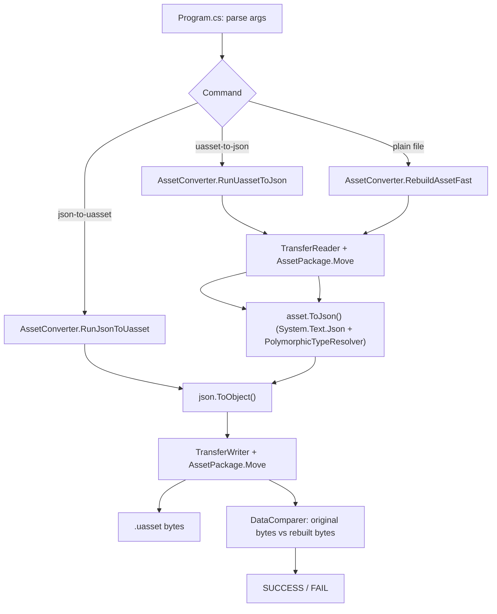

# Architecture Analysis — `AssetTool` folder

> Document generated by automated source-code analysis of `C:\UE\AssetTools\AssetTool`.
> Scope: only the **AssetTool** project (main executable) — does not cover `AssetTool.Generator` or `AssetTool.Test`.

## 1. Project purpose

`AssetTool` is a command-line tool (.NET 8, `net8.0`, `OutputType=Exe`) that reads and writes binary **`.uasset`/`.umap`** files from Unreal Engine (versions 4.0 through 5.6, **non-cooked** assets only) **without needing the Unreal Editor**. It converts:

- `uasset/umap` (binary) → `JSON` (human-readable/editable)
- `JSON` → `uasset/umap` (rebuilt binary)

The design goal is that the rebuilt file is a **byte-for-byte identical** round-trip of the original, which is automatically verified by the "check" command (`AssetTool.exe Input.uasset -log`).

## 2. Entry point (`Program.cs`)

`AssetTool/Program.cs` is a monolithic `Main` based on manual `args[]` parsing, with no CLI library. Supported commands:

| Command | Usage | Function |
|---|---|---|
| `uasset-to-json` | `-i Input.uasset -o Output.json` | Converts an asset to JSON |
| `json-to-uasset` | `-i Input.json -o Output.uasset` | Rebuilds the binary from JSON |
| `diff` | `-i Input.uasset -o OutDir` | Compares the current file version against the `git HEAD` version (uses `git show`) |
| `InputAssets.txt` (1st arg) | list of paths | Batch processing, writes `SucceededAssets.txt` / `FailedAssets.txt` |
| `FailedAssets.txt` (1st arg) | — | Reprocesses only the items that previously failed |
| `FirstFailed` (1st arg) | — | Reprocesses only the first item in `FailedAssets.txt` (useful for debugging) |
| `unit-test <file>` | — | Mode used by the automated tests (writes output JSON) |
| `check-type <file> <type>` | — | Checks whether the asset is of a given type (`IsAssetType`) |
| `get-type <file>` | — | Returns the asset's type/class (`GetAssetType`) |
| `<file>` (fallback) | optional `-v <version>` | "Check" mode: read → write → compare bytes → print SUCCESS/FAIL |

Global flags: `-log` (enables `Log`), `-DebugSaveJson`, `-DebugCheckMember`.

Configuration is loaded from `AppConfig.json` (repo root), deserialized into the `AppConfig` class (`AssetTool/AppConfig.cs`) — containing debug/runtime flags and limits (`MaxFileSize`, `MaxArraySize`, `MaxStringSize`, `ContinueAfterError`, etc.).

## 3. Conversion flow ("round-trip" check)

Described in `TECHNOTES.md` and implemented in `AssetConverter.RebuildAssetFast` (`AssetTool/Converter/AssetConverter.cs`):

```
uasset (bytes1) → AssetPackage (obj)  → JSON  → AssetPackage (obj2, cloned)
                                                        │
                                                        ▼
                                            bytes2 (new binary)
                                                        │
                          compare bytes1 vs bytes2 ─────┘  → SUCCESS / FAIL
```

Main static methods on `AssetConverter`:

- `RebuildAssetFast(path, outDir, fileVersion, fileSkipped)` — full check pipeline (read → serialize to JSON → deserialize → write → compare bytes). Has a cache of already-processed files (`xxHash64` via `K4os.Hash.xxHash`) to avoid reprocessing duplicates.
- `RunUassetToJson` / `RunUassetToJsonFiles` — simple uasset→json conversion (no comparison).
- `RunJsonToUasset` / `RunJsonToUassetFiles` — simple json→uasset conversion.
- `IsAssetType` / `GetAssetType` — reads only the header/asset registry to identify the class type without processing the whole body.

## 4. The "Transfer" pattern — the heart of the serializer

This is the central architectural concept of the entire project. Instead of having separate code for reading and for writing (as is typically done with `BinaryReader`/`BinaryWriter`), each data structure implements **a single `Move(Transfer transfer)` method** that is used for both reading and writing, depending on which concrete `Transfer` implementation is passed in.

### 4.1 Abstract class `Transfer` (`Service/Transfer.cs`)

Defines dozens of `Move(...)` overloads for all primitive types, arrays, lists, dictionaries, and custom types (`FGuid`, `FName`, `FString`, `FText`), plus utilities (`MoveEnum`, `MoveAsByte`, `MoveAsUInt16`, `MoveSingleOrDouble` — for floats/doubles depending on UE5's "Large World Coordinates", `Resize`, `SeekTo`). It also holds shared global state: `GlobalNames`, `GlobalObjects`, `Supports` (version flags), `AppConfig`.

### 4.2 Two concrete implementations

- **`TransferReader`** (`Service/TransferReader.cs`) — implements every `Move(ref T value)` as `value = reader.ReadXxx()`.
- **`TransferWriter`** (`Service/TransferWriter.cs`) — implements every `Move(ref T value)` as `writer.Write(value)`.

Because the same "model" code (`obj.Move(transfer)`) runs with either implementation, **the binary layout of the file is described exactly once** and works in both directions — eliminating duplication and drift between read and write logic.

### 4.3 `ITransferable` interfaces (`Model/Interfaces/Transferable.cs`)

- `ITransferable` — base contract: `ITransferable Move(Transfer transfer)`.
- `ITransferable<T1>`, `<T1,T2>`, `<T1,T2,T3>` — variants that take extra parameters during `Move` (extra context needed to decode certain types).
- `ITransferableRaw` — for "raw" types (without a property tag).
- `ITransferablePropertyTag` — for types that can conditionally "disappear" (equivalent to a `false` return from `Serialize(FArchive&)` in the original C++).
- `ITransferableAutoCheck` / `TransferableAutoCheck` — **self-verification** infrastructure: when reading an object, it optionally rewrites it (both binary and via JSON) and compares it byte-for-byte with what was read, throwing an exception on mismatch (enabled via `AppConfig.DebugCheckMember`). This is the mechanism used during development/testing to guarantee a perfect round-trip.

### 4.4 Version support (`Supports.cs`, `SupportsAfter`)

A class with **hundreds of boolean properties** (`VER_UE4_STATIC_MESH_STORE_NAV_COLLISION`, `PROPERTY_TAG_COMPLETE_TYPE_NAME`, `LARGE_WORLD_COORDINATES`, etc.) that query `GlobalObjects.UESupport(...)`, comparing the file's version (`EUnrealEngineObjectUE4Version` and custom versions) — replicating the `#if WITH_...` macros / version checks from Unreal's C++ source. This lets a single model class (e.g. `UStaticMesh`) correctly read assets from any engine version by turning fields on/off based on the version detected in the file header.

## 5. Data model (`Model/`)

- **`Model/Asset/`** — structures of the `.uasset` file itself: `AssetPackage` (root), `AssetHeader` (with `PackageFileSummary`, `NameMap`, `ImportMap`, `ExportMap`, `DependsMap`, `AssetRegistryData`, etc.), `FooterData`, `FPackageFileSummary`, `ImportMap`/`ExportMap` (object import/export tables), `ThumbnailTable`, `MetaDataMap`.
- **`Model/Object/`** — `UObject` (base class of every serializable UE object, see section 6) and `UMetadata`.
- **`Model/Attributes/`** — custom attributes: `JsonAssetAttribute` (marks concrete asset classes, e.g. `[JsonAsset("StaticMesh")]`, discovered automatically via reflection), `LocationAttribute` (documents the original Unreal Engine C++ function/file the logic was ported from — present on almost every `Move()`), `TransferableStructAttribute`, `BaseEngineIniAttribute`.
- **`Model/Const/`** — `Enums.cs`, `Versions.cs` (all engine version enums), `Consts.cs`, `ConstTypes.cs`, `Supports.cs`.
- **`Model/Interfaces/`** — `ITransferable*`, `IDynamicSize`, `IValueConverter`.
- **`Model/Singleton/`** — `GlobalNames` (the package's name table — UE's "name table", string↔index mapping) and `GlobalObjects` (static registry of every `[JsonAsset]` class discovered via reflection + state of the current read: current object, file size, version, etc.).
- **`Model/Wrapper/Wrap.cs`** — generic wrapping utility.

## 6. `UObject` and the "Property Tags" system (the "heart within the heart")

`Model/Object/UObject.cs` is the base class of **all** ~500 classes under `AssetTool/UE/**` that represent concrete engine types (`UStaticMesh`, `UTexture2D`, `UMaterial`, `USkeletalMesh`, etc. — see section 7). It does not enumerate fixed fields: instead it holds a `Dictionary<string, object> Members` and delegates serialization to the generic **Property Tags** mechanism, which mirrors how Unreal Engine itself serializes UObject properties in a versioned, self-describing way:

```csharp
public virtual ITransferable Move(Transfer transfer)
{
    Members ??= [];
    transfer.MoveTags(Members, 0, this);
    PossiblySerializeObjectGuid(transfer);
    return this;
}
```

`FPropertyTagExt.MoveTags` (`UE/Runtime/CoreUObject/Public/UObject/PropertyTag.cs`) is the central loop: it reads a sequence of `FPropertyTag` (name, type, size, flags, optional guid) terminated by a "None" tag, and for each tag dispatches (`DerivedTag`) to one of ~30 classes in `AssetTool/Json/Scalar/*` and `AssetTool/Json/Array/*` based on the UE property's `Type` (`IntProperty`, `BoolProperty`, `StructProperty`, `ObjectProperty`, `ArrayProperty`, etc.) — each one knowing how to convert to/from the friendly JSON representation (`FromNative`/`ToNative`/`GetNative`).

This is what lets AssetTool **read properties of any UE class without needing prior knowledge of all its fields** — the generic property "body" works through data reflection (tags), while only the *native, fixed, non-tagged* fields (complex internal structs) need hand-written C# classes with an explicit `Move()`.

Key pieces of this subsystem:
- `Json/Scalar/*PropertyJson.cs` — one wrapper per scalar type (`FIntPropertyJson`, `FBoolPropertyJson`, `FStrPropertyJson`, `FStructPropertyJson`, `FEnum32/64PropertyJson`, `SoftObjectPropertyJson`, etc.), all inheriting from `BasePropertyJson : Dictionary<string, object>`. The JSON dictionary key encodes metadata (name, enum type, array index, guid) as a single string (`BuildKey`/`ExtractKey`), allowing the full `FPropertyTag` to be reconstructed from JSON.
- `Json/Array/*PropertyJsonArray.cs` — equivalent for array properties (`FBoolPropertyJsonArray`, `FObjectPropertyJsonArray`, etc.), with `ArrayJsonConverter` bridging the two.

## 7. Unreal Engine type classes (`AssetTool/UE/**`) — 506 files

This is the bulk of the project (506 of the ~620 `.cs` files). The folder tree **mirrors exactly the Unreal Engine C++ source directory structure** (`Runtime/Core`, `Runtime/CoreUObject`, `Runtime/Engine`, `Runtime/Experimental/Chaos`, `Plugins/FX/Niagara`, `Plugins/Animation/ControlRig`, etc.), with one `.cs` file per C++ class/struct relevant to serialization:

- `UE/Runtime/Core/**` — primitive types (`FVector`, `FQuat`, `FTransform`, `FColor`, `FString`, `Guid`, `FDateTime`, `FText`...).
- `UE/Runtime/CoreUObject/**` — UE's reflection/property system (`FProperty`/`UProperty` and all its variants: `FArrayProperty`, `FStructProperty`, `FMapProperty`, `FEnumProperty`, etc.), `PropertyTag`, `Class.cs`/`UClass.cs` (class definitions), `LinkerLoad.cs`, `ObjectResource.cs` (import/export).
- `UE/Runtime/Engine/**` — "high-level" asset classes: `StaticMesh`, `SkeletalMesh`, `Texture2D`, `Material`, `AnimSequence`, `SoundWave`, `World`, `Actor`, components (`SceneComponent`, `StaticMeshComponent`...), `DataTable`, `CurveTable`, etc.
- `UE/Plugins/**` — support for optional engine plugins: Niagara (FX), ControlRig/RigVM (animation), PCG, TextureGraph, Chaos Cloth/Outfit, Enhanced Input, MetaHuman, Interchange, Variant Manager, Remote Control, etc.
- `UE/Runtime/Experimental/Chaos/**`, `GeometryCore/**` — physics and geometry (collision shapes, dynamic meshes).
- `UE/Editor/**` — editor/blueprint-only types (`K2Node_DynamicCast`, `EdGraph`).

Every class follows the same pattern as `UStaticMesh` (referenced above): strongly-typed C# fields + a `Move(Transfer transfer)` that calls `base.Move(transfer)` and then reads/writes "native binary" fields (not covered by the Property Tags system) in the exact order of the original C++, frequently guarded by version checks (`transfer.Supports.XXX`) and annotated with the `[Location("...")]` attribute pointing to the source C++ function (e.g. `[Location("void UStaticMesh::Serialize(FArchive& Ar)")]`) — essential for tracing/debugging against the actual engine source code.

**Important note**: many of these ~506 classes (and the 671 KB `JsonAssetClasses.json` file at the repo root) appear to be **auto-generated** from the Unreal Engine C++ source by the sibling `AssetTool.Generator` project (not analyzed in detail here, since the request focused on `AssetTool`), which explains the volume and the structural fidelity to Epic's original code.

## 8. Service layer (`AssetTool/Service/`)

| File | Responsibility |
|---|---|
| `Transfer.cs` | Central abstract class (see section 4) |
| `TransferReader.cs` / `TransferWriter.cs` | Concrete read/write implementations |
| `TransferNull.cs` | "No-op" implementation (likely for size computation without real I/O) |
| `JsonSerializerExt.cs` | `ToJson`/`ReadJson`/`ToObject` extensions, default `System.Text.Json` options (custom converters for `FName`, `FString`, `FTextKey`; polymorphic resolver) |
| `PolymorphicTypeResolver.cs` | `System.Text.Json` polymorphic type resolver — registers every `[JsonAsset]` class as a `JsonDerivedType` of `UObject`, using the `"__type"` discriminator |
| `BinSerializerExt.cs` | Auxiliary binary serialization extensions |
| `DataComparer.cs` | Compares streams/byte arrays byte-for-byte, used in the round-trip check |
| `Extensions.cs` | General string/utility extensions (`NameOnly`, `Hash`, `GetTempJsonPath`, etc.) |
| `Log.cs` | Simple logger enabled by the `-log` flag |

## 9. End-to-end flow summary



Inside `AssetPackage.Move`: `MoveHeader` (reads/writes `AssetHeader`) → `SetupObjects` (builds the `AssetObject` list from `ExportMap`) → `LoadAllObjects` (for each object, resolves the right C# class via `GlobalObjects.AssetMovers[ClassName]` and calls `obj.Move(transfer)`, which in turn delegates the "body" to the Property Tags mechanism and the remainder to typed native fields) → `Footer.Move` (trailing package data).

## 10. Notable design points

- **Read/write symmetry via `Move()`** — avoids duplication and ensures any change to the binary layout is automatically reflected in both directions.
- **Fidelity to Epic's source code** — the ubiquitous `[Location(...)]` attribute traces back to the original C++ function; the folder tree mirrors the engine's source tree.
- **Multi-version support via computed flags (`Supports`)** — a single class covers UE 4.0 → 5.6.
- **Generic Property Tags system** — handles hundreds of "loose" UObject property types without needing a fixed C# class for each one; only fixed binary fields (outside the tag system) require explicit classes.
- **Built-in self-verification (`TransferableAutoCheck`)** — a QA mechanism that compares, field by field, the result of re-reading/re-writing against the original, used both for manual debugging and by the automated tests.
- **Code generation** — most of `UE/**` is likely generated by `AssetTool.Generator` from the engine source code, keeping the project in sync with multiple UE versions.

## 11. Relevant configuration/data files at the repo root

- `AppConfig.json` — runtime/debug flags (see section 2).
- `JsonAssetClasses.json` (671 KB) — `ClassName → BaseClassName` map of every recognized UE class (used by `GlobalObjects.RecognizedClasses`).
- `TECHNOTES.md` — describes the internal check process and how to run the tests.
- `README.md` — project overview, per-UE-version test coverage status (extensive table for versions 4.0–5.6), and basic CLI usage.
